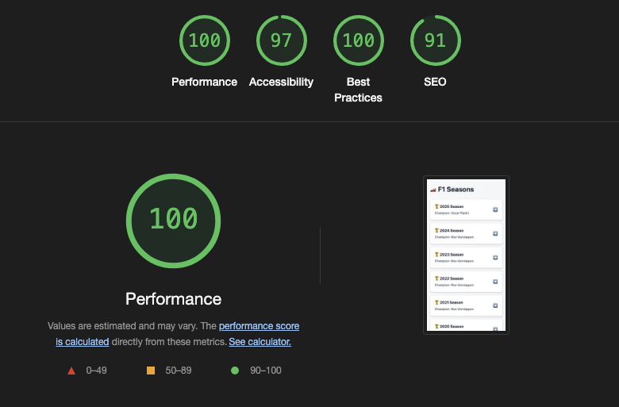

# Checklist for Assignment

## Goal

Build and implement a production‑ready, end‑to‑end web/mobile application that:
- Shows Formula 1 World Champions from 2005 to the present year in an attractive
Single Page Application (SPA) or Mobile Application.
- Persists race‑winner data in a database and exposes it through your own backend
API.
- Ships with a fully automated CI/CD pipeline.
- Runs backend and DB locally with a single docker compose up command.
The exercise lets you demonstrate full‑stack skills: API & data modelling, secure coding,
automated testing, DevOps, and clean, reusable front‑end code.

## Functional requirements

1. Season list - Display each season’s World Champion (2005 to present).
2. Race winners - Clicking a season reveals all grand‑prix winners for that year.
3. Highlight champions - In the race list, visually highlight the rows where the winner
is also that season’s champion.
3. Persist winners - On first request, fetch data from the public Ergast Developer API
(https://api.jolpi.ca/ergast/), then store or update it in your own database.
4. Subsequent requests must be served from your backend.
5. Graceful errors & loading states - Handle slow networks, API errors, and empty
states.

## Non-functional requirements

- Frontend SPA with React, Vue, Angular or Svelte. 100 %
typed (TypeScript). State handled with a modern
approach. OR Native Mobile with Swift/Kotlin.
Tests (unit + component).
- Backend Language & framework of your choice
(Node/Express, Spring Boot, etc.). REST or
GraphQL endpoint(s). Proper layering (domain /
service / controller). API contract documented
(OpenAPI). Unit tests.
- Database Relational (PostgreSQL, MySQL) or NoSQL
(Mongo). Add sensible indexes & constraints.
- CI/CD GitHub Actions, GitLab CI, Butbucket Pipelines,
TravicCI, CircleCI or any free tier CI service.
Stages: install → lint → test → build.
Reject on test failure.
- Containerisation
Multi‑stage Dockerfiles. Single
docker‑compose.yml starting backend,
database. Healthchecks & environment
variables.
- Nice to have
- SSR/SSG
(Next.js/Nuxt),
Lighthouse score ≥ 90.
Caching layer (e.g.
Redis). Async job to
refresh seasons weekly
after every race.
- Seed script;
containerised admin
tool (pgAdmin, Mongo
Express).
- Automatic deploy to
free tier platform
(Render, Railway,
Fly.io, or your own).
Security: Dependency
scan via
CodeQL/Snyk/Trivy.
- Reject on scan failure.
- Docker image pushed
to public registry.
- Makefile targeting
common tasks.

## Requirements Traceability Matrix

| Requirement | Status | Implementation Reference | Notes |
|-------------|--------|--------------------------|-------|
| **Functional Requirements** |
| Display seasons with World Champions (2005-present) | ✅ | README.md:L7, ARCHITECTURE.md:L78-82 | Interactive SPA with season list and champion data |
| Click season to reveal race winners | ✅ | README.md:L7, ARCHITECTURE.md:L93-99 | Component-based navigation with custom hooks |
| Highlight champion rows in race list | ✅ | Directory: frontend/src/components/race/ | Visual highlighting implemented in RaceCard/RaceList components |
| Fetch data from Ergast API on first request | ✅ | ARCHITECTURE.md:L46-50, L53-54 | Ergast service with client, mapper, repository pattern |
| Store data in database | ✅ | ARCHITECTURE.md:L63, README.md:L75 | PostgreSQL with Prisma ORM |
| Serve subsequent requests from backend | ✅ | ARCHITECTURE.md:L62, L96-97 | Redis caching with 1-hour TTL |
| Graceful error & loading states | ✅ | ARCHITECTURE.md:L78-82, Directory: frontend/src/components/UI/ | Custom hooks with {data, loading, error}, ErrorMessage/LoadingSpinner components |
| **Non-Functional Requirements** |
| **Frontend** |
| React SPA with TypeScript | ✅ | README.md:L73, ARCHITECTURE.md:L84-88 | React 19 + TypeScript with 100% typing |
| Modern state management | ✅ | ARCHITECTURE.md:L81-82 | Custom hooks pattern, no Redux needed for current complexity |
| Unit + component tests | ✅ | Directory: `frontend/src/**/__tests__/` | Comprehensive test coverage for all components |
| **Backend** |
| Modern framework with proper layering | ✅ | ARCHITECTURE.md:L28-43, README.md:L74 | Express + TypeScript with Route→Controller→Service→Repository pattern |
| REST endpoints | ✅ | README.md:L40, backend/docs/openapi.yaml | RESTful API with OpenAPI documentation |
| API contract documented | ✅ | README.md:L40, backend/docs/openapi.yaml | OpenAPI specification available |
| Unit tests | ✅ | Directory: `backend/src/**/__tests__/` | Complete unit test coverage for all layers |
| **Database** |
| Relational database (PostgreSQL) | ✅ | README.md:L75, ARCHITECTURE.md:L63 | PostgreSQL 15 with Prisma ORM |
| Sensible indexes & constraints | ✅ | backend/prisma/migrations/ | Database migrations with proper indexing |
| **CI/CD** |
| GitHub Actions pipeline | ✅ | ARCHITECTURE.md:L116 | Automated testing, deps scan, linting, building, deployment |
| Stages: install → lint → test → build | ✅ | ARCHITECTURE.md:L116 | Complete CI/CD pipeline with proper stages |
| Reject on test failure | ✅ | ARCHITECTURE.md:L116 | Pipeline fails on test/lint failures |
| **Containerization** |
| Multi-stage Dockerfiles | ✅ | ARCHITECTURE.md:L117-119, README.md:L76 | Optimized Docker builds for frontend/backend |
| Single docker-compose.yml | ✅ | README.md:L24-26 | Complete orchestration with `make up` |
| Healthchecks & environment variables | ✅ | README.md:L29-31, L136-147 | Environment configuration documented |
| **Nice to Have** |
| Lighthouse score ≥ 90 | ✅ |  | Score 100. Live demo available |
| Redis caching layer | ✅ | ARCHITECTURE.md:L62, README.md:L75 | 1-hour TTL caching implemented |
| Async job for weekly refresh | ✅ | ARCHITECTURE.md:L54-56 | Cron jobs for data synchronization |
| Seed script | ✅ | README.md:L42, backend/prisma/seed.ts | Automatic database seeding on startup |
| Containerized admin tool | ✅ | README.md:L38 | pgweb for database administration |
| Automatic deploy to Railway | ✅ | README.md:L3, ARCHITECTURE.md:L115-123 | Production deployment on Railway |
| Security dependency scanning | ✅ | ARCHITECTURE.md:L116 | CodeQL |
| Docker image to public registry | ✅ | ARCHITECTURE.md:L116 | Docker publishing to Dockerhub |
| Makefile for common tasks | ✅ | README.md:L81-98, Makefile | Comprehensive Makefile with development commands |

